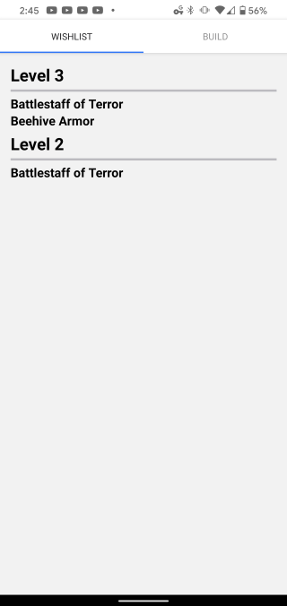

# MCDBuild

This project is a React Native app to help Minecraft Dungeons players determine what levels to play to get the items they want.

## Use

### **Create a Build**

On the build page, select and item for a character slot by tapping on the '?' image. That will bring up a list of all valid items for that slot that you can scroll or type in an item name to find the item you want to add. When you tap on the item, it will be added to your build.

### **Add items to your Wishlist**

Tap the wishlist checkbox to add a build item to your wishlist. Once the wishlist has at least one item, go to the wishlist tab to view what levels will drop one or more of your wishlist items. The level with the most wished for items will be at the top and you can play that level for the best chance at getting an item you want for your build!

## Installation

This is an expo project using json-server to serve game data to the application. To run this locally, follow these steps after pulling the repo:

1. Replace the IP address in /shared/baseUrl.js with your local IP address
2. Start the json server with a delay so fetch promises to the server wont resolve immediately

    Example: json-server --watch db.json -p 3001 -d 2000 -H [local IP]

3. Start your Expo Server

## Development Goals

These are the goals I had for creating this application that guided choices I made during development.

### **Create a React Native application**

My previous work has been web based or at least build for web first. For this project I wanted to build for Native first to explore different mobile packages, navigation and data structure that may server mobile better or at least see where native and web code bases may differ or conflict.

### **Lean on Hooks and Context instead of Redux**

I have used Redux in the past in scenarios where it was under leveraged as global state with extra features that go unused. This small app does not need Redux to manage dataflow, even contexts may be overkill, but I wanted to use contexts and custom hooks to get more experience using them and make the flow of data clear through the app.

### **Use folder and file structure to guide development**

Rather than decide on a folder structure where new files/components have to find a place to live before they have any function, I wanted to try a file structure first approach. To meet this goal I followed a mantra that every component would be built in the file that it is used. The component moves to its own file once it should be shared with another file or once it reaches a high level of complexity that obscures the parent component, which could be idicated by unique imports, unique styling or significant logic/side effects.

## Future Improvements

* Fill database with real game data
* Styling revision of wishlist page
* Styling revision of build page
* Move styles into their own files
* Set up a real hosted database
* Build app to .apk for distribution
  